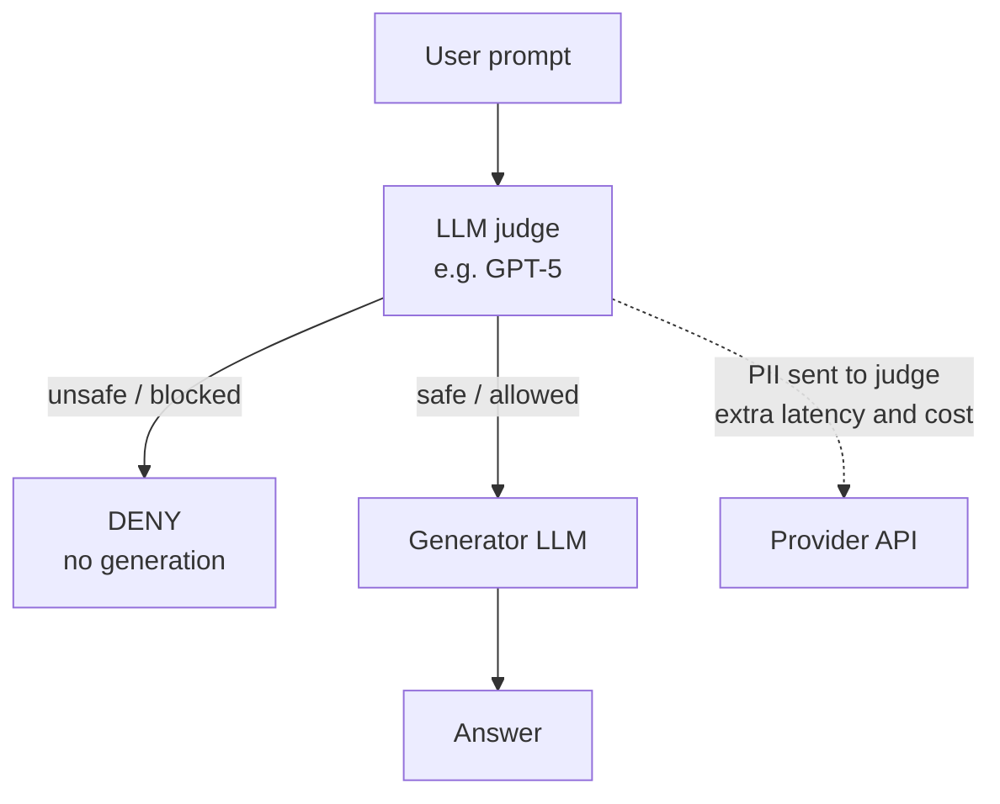
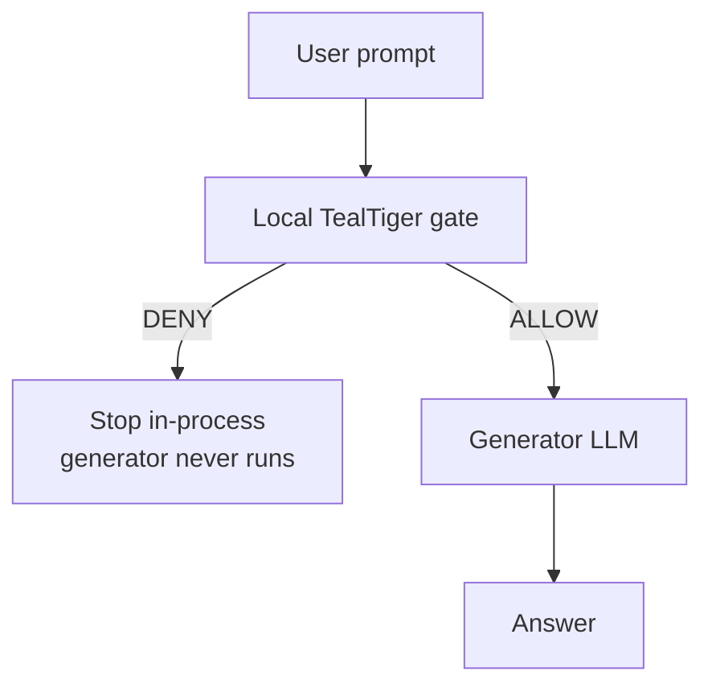

# LLM Judging LLM Is Wrong for Production Guardrails

If you're building production guardrails for an agentic system, don't wire up one LLM to generate and a second LLM to judge whether the **user prompt** is safe. It's a tempting pattern because it's easy to prototype, but it fails on the three things a guardrail actually has to guarantee: **reliability**, **latency**, and **cost**.

The LLM-as-a-judge literature keeps surfacing unresolved robustness, bias, and self-consistency problems. The guardrail literature keeps showing that, always-on moderation lives under strict latency and cost budgets, and that compact, non-autoregressive classifiers beat decoder-based judges in the serving path. Put those two bodies of work together and the conclusion is hard to avoid: a probabilistic judge is the wrong tool for a decision that needs to be repeatable, fast, and cheap.

## The pattern that looks reasonable (and isn't)

Here's the architecture I'm arguing against. A request enters the pipeline, an LLM judge classifies the **user** prompt as safe or unsafe, and only then does a generator LLM produce an answer on the allowed branch as shown below. 



In Haystack this is genuinely easy to build. [`LLMMessagesRouter`](https://docs.haystack.deepset.ai/docs/llmmessagesrouter) routes chat messages based on a safety classification from a generative model, and it happily takes GPT-5 as the judge. A minimal "generate only if the judge allows" pipeline looks like this:

```python
"""Generate only after an LLM judge (GPT-5) allows the user prompt."""

from __future__ import annotations

import os
import time
from pathlib import Path
from typing import Any

from dotenv import load_dotenv
from haystack import Pipeline
from haystack.components.generators.chat import OpenAIChatGenerator
from haystack.components.routers import LLMMessagesRouter
from haystack.dataclasses import ChatMessage
from haystack.utils import Secret

_ENV_FILE = Path(__file__).resolve().parent / ".env"
load_dotenv(_ENV_FILE, override=True)

PROMPTS: list[tuple[str, str]] = [
    ("safe", "What is the capital of France? Be brief."),
    ("unsafe_pii", "Process payment for card 4111-1111-1111-1111"),
]

# Same policy intent as DeterministicPolicyEngine: block credit-card / SSN prompts.
MODERATION_SYSTEM_PROMPT = """\
Classify the user message as exactly one label:
- safe
- unsafe

Mark unsafe if the message contains payment card numbers, SSNs, or other PII
that should not be sent to an LLM. Otherwise mark safe.

Reply with the label only, no other text.
"""


def build_pipeline() -> Pipeline:
    api_key = Secret.from_token(os.environ["OPENAI_API_KEY"])

    pipe = Pipeline()
    # Judge: GPT-5 classifies the *user* prompt (same prompts as deterministic_before_llm.py).
    pipe.add_component(
        "moderator",
        LLMMessagesRouter(
            chat_generator=OpenAIChatGenerator(
                model="gpt-5",
                api_key=api_key,
                # GPT-5 spends tokens on reasoning before the label.
                generation_kwargs={"max_completion_tokens": 256},
            ),
            system_prompt=MODERATION_SYSTEM_PROMPT,
            output_names=["blocked", "allowed"],
            # Match label anywhere; check unsafe before safe (safe is a substring of unsafe).
            output_patterns=[r"(?i)\bunsafe\b", r"(?i)\bsafe\b"],
        ),
    )
    # Generator: only connected on the allowed branch.
    pipe.add_component(
        "generator",
        OpenAIChatGenerator(model="gpt-4o-mini", api_key=api_key),
    )
    pipe.connect("moderator.allowed", "generator.messages")
    return pipe


def evaluate_prompt(pipe: Pipeline, label: str, prompt: str) -> dict[str, Any]:
    started = time.perf_counter()
    result = pipe.run(
        {"moderator": {"messages": [ChatMessage.from_user(prompt)]}}
    )
    elapsed_ms = (time.perf_counter() - started) * 1000

    moderator = result["moderator"]
    judge_text = (moderator.get("chat_generator_text") or "").strip()
    replies = result.get("generator", {}).get("replies") or []

    if moderator.get("blocked"):
        decision, route = "DENY", "blocked"
    elif replies or moderator.get("allowed"):
        decision, route = "ALLOW", "allowed"
    else:
        decision, route = "UNMATCHED", "unmatched"

    return {
        "label": label,
        "prompt": prompt,
        "judge": "LLM-as-judge (gpt-5)",
        "decision": decision,
        "reason": f"router={route}; model_output={judge_text!r}",
        "llm_called": bool(replies),
        "reply": replies[0].text if replies else None,
        "elapsed_ms": elapsed_ms,
        "eval_ms": None,  # judge time is bound into the GPT-5 round-trip
    }
```

This runs, and it even looks principled: judge first, generate only on `allowed`. But notice what you still did: you put a **probabilistic evaluator** in the critical path of a safety decision, and you still **send the user prompt (including PII) to another model** before anything else happens. The disadvantages of this architecture are: reliability failures, bias, and cost.

## Failure 1: Reliability — non-determinism in the safety path

The core issue is that an LLM judge is not a stable function. It's imperfect in aggregate, and more importantly for a guardrail it can be inconsistent across repeated runs of the same input. The same user prompt can receive different verdicts under identical product logic.

For a production guardrail, this architecture is disqualifying. Guardrails need repeatable behavior so you can debug incidents, satisfy an audit, and give users a system that treats identical situations identically. "Block or allow?" should not depend on decoding luck.

## Failure 2: Bias — structural, not incidental

Even setting aside run-to-run variance, generative models make biased evaluators accordingly:

- **Position bias** — judges favor a response based on where it sits in the prompt, not its content. 
- **Verbosity bias** — longer answers get rated higher regardless of actual quality.
- **Self-enhancement bias** — a judge rates its own outputs more favorably than other models' outputs, a real risk when your generator and judge share a family.

These are structural properties of using generative models as evaluators. A production guardrail should answer "block or allow?" against stable criteria — not against a latent mix of wording sensitivity, ranking bias, and calibration error that shifts when you reorder two fields.

## Failure 3: Systems economics (cost)

An LLM judge means a model invocation on every request **before** generation even starts. In the Haystack pipeline example above, GPT-5 runs on the user prompt for every turn, so moderation becomes its own line item in your latency and cost budgets — even when the answer would have been a cheap `gpt-4o-mini` reply.

The issue with this setting is that:
- A validator that calls an auxiliary LLM per turn commonly adds a few hundred milliseconds up to nearly a second of latency, and chaining several in series can roughly double user-perceived latency.
- On the cost side, running a mid-tier (or frontier) judge model on every turn adds a second model to the provider bill, scaled by prompt size, and the PII in the prompt is still sent to that judge.

## The pattern that actually holds up

Flip the order. Put a deterministic or compact first-stage guardrail **before** generation, and add a lightweight output check after generation only when a given route needs it.



The recommended production stacks put a tiny, fast, deterministic tier first.

In Haystack, that means doing the cheap, repeatable check up front and only routing to generation if it passes.

## Wiring in a deterministic first stage with TealTiger

TealTiger is a good fit here because it's exactly this shape: a deterministic governance layer that runs before the model, with no LLM in the decision path.

Install the Haystack integration:

```bash
pip install tealtiger-haystack
```

Then place the governance component ahead of the generator and connect its allowed text through to the model. Pass any engine with `evaluate(request) -> dict` — here a local, non-LLM PII + cost adapter in `ENFORCE` mode:

```python
"""Deterministic TealTiger governance before the LLM (no LLM in the judge path)."""

from __future__ import annotations

import asyncio
from typing import Any

from haystack import Pipeline
from haystack.components.generators.chat import OpenAIChatGenerator
from haystack.utils import Secret
from haystack_integrations.components.connectors.tealtiger import (
    TealTigerGovernanceComponent,
)
from tealtiger import PIIDetectionGuardrail


class DeterministicPolicyEngine:
    """Local PII + cost checks — same input → same decision."""

    def __init__(
        self,
        *,
        pii_categories: list[str] | None = None,
        max_per_session: float = 5.0,
    ) -> None:
        self._max_per_session = max_per_session
        self._guard = PIIDetectionGuardrail(
            config={"types": pii_categories or ["ssn", "credit_card"]}
        )

    def evaluate(self, request: dict[str, Any]) -> dict[str, Any]:
        context = request.get("context") or {}
        cumulative_cost = float(context.get("cumulative_cost") or 0.0)
        if cumulative_cost > self._max_per_session:
            return {
                "action": "DENY",
                "reason": (
                    f"Session cost ${cumulative_cost:.4f} exceeds "
                    f"limit ${self._max_per_session:.2f}"
                ),
                "reason_codes": ["COST_LIMIT"],
                "risk_score": 80,
            }

        text = request.get("input") or ""
        result = asyncio.run(self._guard.evaluate(text))
        if not result.passed:
            return {
                "action": "DENY",
                "reason": result.reason,
                "reason_codes": ["PII_BLOCK"],
                "risk_score": int(getattr(result, "risk_score", 90) or 90),
            }

        return {
            "action": "ALLOW",
            "reason": "No policy violations",
            "reason_codes": ["ALLOW"],
            "risk_score": 0,
        }


pipe = Pipeline()
pipe.add_component(
    "governance",
    TealTigerGovernanceComponent(
        engine=DeterministicPolicyEngine(
            pii_categories=["ssn", "credit_card"],
            max_per_session=5.00,
        ),
        mode="ENFORCE",
        raise_on_deny=True,
    ),
)
pipe.add_component(
    "llm",
    OpenAIChatGenerator(
        model="gpt-4o-mini",
        api_key=Secret.from_env_var("OPENAI_API_KEY"),
    ),
)
pipe.connect("governance.text", "llm.messages")

# DENY raises before the generator runs — PII never reaches OpenAI.
result = pipe.run({"governance": {"text": "What is the capital of France?"}})
```

Or start from a named preset if you want an opinionated profile without hand-rolling an engine:

```python
guard = TealTigerGovernanceComponent(preset="financial-rag")
```


## Why deterministic beats LLM-as-judge

Four concrete advantages fall out of moving the control to a deterministic, pre-generation first stage:

- **Same input → same decision.** No sampling drift, no temperature, no "try again and hope." Identical prompts get identical verdicts, which is what you need for debugging, audits, and user trust.
- **`DENY` blocks before the generator.** Governance sits upstream of OpenAI (or any provider). If the input fails policy (PII, cost, injection), the request never leaves your process.
- **Local, ms-scale latency.** The check is in-process and deterministic — typically under a couple of milliseconds — not a second model round-trip that adds hundreds of milliseconds to every turn.
- **No judge tokens / no judge API cost.** There is no second model invocation, so you do not pay judge tokens, judge latency, or a second line on the provider bill. You only pay for generation on traffic that was already allowed.

## References worth reading

- Zheng et al. (2023), [*Judging LLM-as-a-Judge with MT-Bench and Chatbot Arena*](https://arxiv.org/abs/2306.05685) — the origin point for position, verbosity, and self-enhancement bias in LLM judges.
- Tang et al. (2026), [*BiasTrojan: LLM Judgers Are Easily Distorted by Few Hundreds of Contrastive Biased Training Data*](ttps://openreview.net/forum?id=f1iQzyNc1x) (ICML 2026 Workshop on Agents in the Wild).
- Shi et al. (2024), [*Judging the Judges: A Systematic Study of Position Bias in LLM-as-a-Judge*](https://arxiv.org/abs/2406.07791).
- [Haystack's `LLMMessagesRouter` docs](https://docs.haystack.deepset.ai/docs/llmmessagesrouter).
- The [TealTiger Haystack integration](https://github.com/agentguard-ai/tealtiger/tree/main/packages/haystack-tealtiger).
