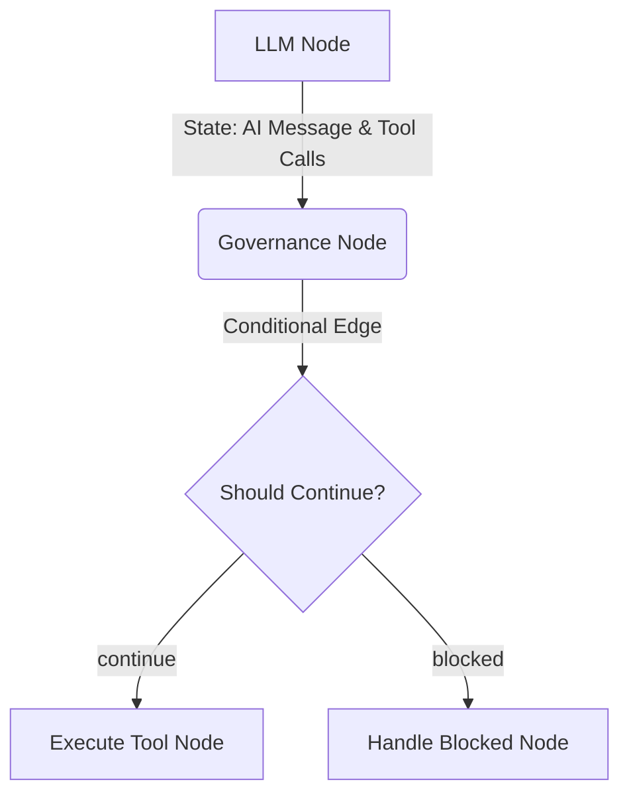

# Governance as a Conditional Routing Node in LangGraph: TealTiger Integration

[LangGraph](https://github.com/langchain-ai/langgraph) is widely recognized as the top-rated agent framework for production in 2026, thanks to its graph-based state machine architecture. When building complex, autonomous, multi-actor systems, you need a way to ensure that nodes don't execute dangerous tools or leak PII.

Enter the **TealTiger LangGraph Integration**. Because LangGraph relies on nodes and conditional edges, TealTiger's governance logic maps perfectly to a **Conditional Routing Node**.

## The Architecture: Governance as a Node

Instead of wrapping the LLM calls implicitly (which hides logic), LangGraph encourages explicit state transitions. By placing the TealTiger `governance_node` immediately after your LLM node, you can intercept the LLM's proposed tool calls or text responses, evaluate them, and route the state accordingly.



## How to use it

The `langgraph-tealtiger` package exposes a plug-and-play node and edge function that you can add straight into your `StateGraph`.

### 1. Installation

```bash
pip install langgraph-tealtiger
```

### 2. Building the Governed Workflow

```python
from langgraph.graph import StateGraph
from tealtiger.integrations.langgraph import governance_node, should_continue

# Initialize your state graph
workflow = StateGraph(AgentState)

# Add your standard nodes
workflow.add_node("llm", call_llm)
workflow.add_node("execute_tool", execute_tool)
workflow.add_node("blocked", handle_blocked)

# Add the TealTiger Governance Node
workflow.add_node("governance", governance_node)

# Route from LLM to Governance
workflow.add_edge("llm", "governance")

# Route based on TealTiger's decision!
workflow.add_conditional_edges(
    "governance",
    should_continue,
    {"continue": "execute_tool", "blocked": "blocked"},
)
```

## Why this is a game changer for LangGraph

1. **Explicit Control**: The governance step is a visible node in your graph. You can inspect exactly what entered the governance engine and what decision was made in LangSmith or your tracing tool of choice.
2. **Graceful Degradation**: If a tool call is blocked (e.g. LLM hallucinates a non-allowlisted tool or passes PII), you route to the `blocked` node. This node can inject a system message back to the LLM explaining *why* it was blocked, allowing the agent to self-correct and try again safely.
3. **Audit Trails**: Every decision made by `governance_node` generates structured audit evidence required by TealEngine compliance standards.

Check out the full [example repository](https://github.com/agentguard-ai/tealtiger/tree/main/packages/langgraph-tealtiger/examples) to see it in action!
